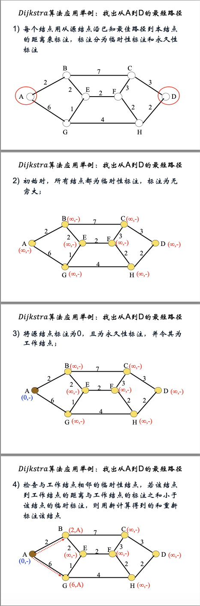
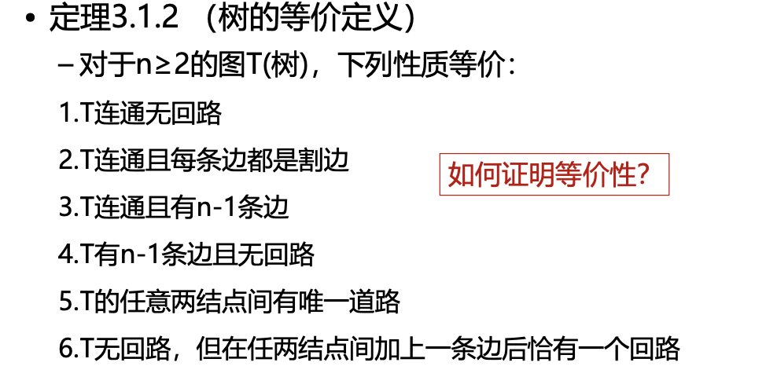
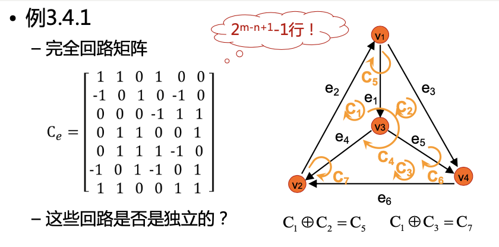
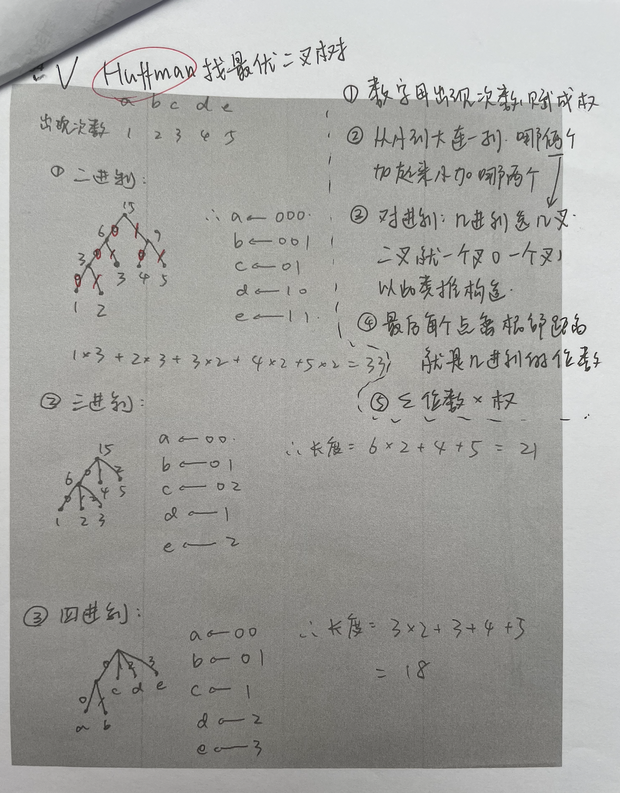
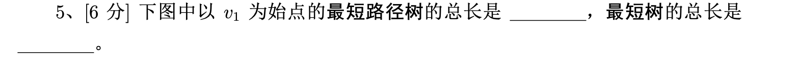
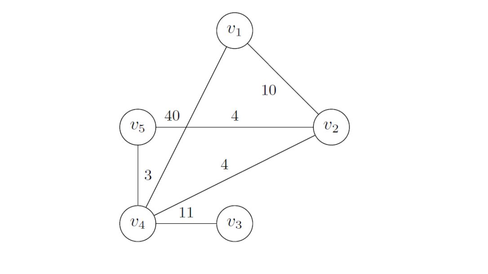
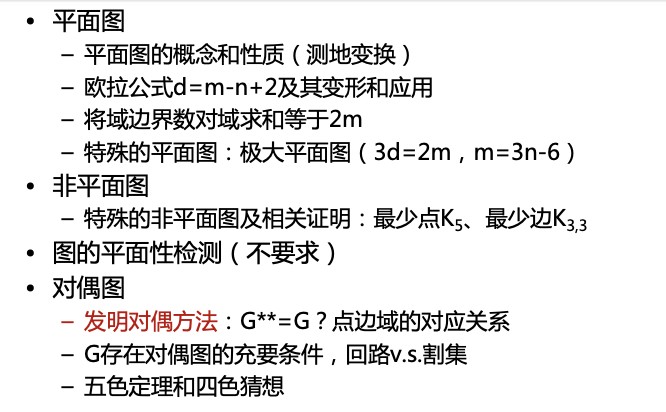

### 自用图论+代数结构知识点总结库
大部分摘抄自https://www.cnblogs.com/shzr/p/16164277.html
#### cha1
- **邻接矩阵**：一个矩阵，a(i,j)=[ij间有边]；**无向图的邻接矩阵是对称的**。**有向图只有出度记录1，入度是0.**
- **权矩阵**：w(i,j)=ij间的边权；
- **关联矩阵**：**纵列为一行一行点，行为一列一列边，每列一个1一个-1，分别指出的顶点和入的顶点（若有向）**
- **边列表**：将每条边的两个端点和权值列出来;
- **正向表**：记录每个结点的直接后继。书中的方法类似把若干数组连缀起来，如：1的后继有24,2的后继有13,3的后继有4，4的后继有2.那就先开一个数组记录每个点有几个后继，相当于索引：2,2,1,1；然后用一个大数组记录所有后继：241342.
- **逆向表**：和正向表类似，但要改成记录前驱;
- **邻接表**：对每个结点，开一个链表存它的后继。
- cha1.cpp 邻接矩阵/权矩阵，关联矩阵，邻接表，正向表，逆向表的表达
#### cha2
###### 1 道路与回路
- 如果一条道路的起点=终点，则称为圈（回路）。
- 没有重复边的道路和回路称为简单道路、回路。没有重复点的称为初级道路、回路。
- 弦：若C是简单图G中**结点大于3**的一个初级回路，x,y在C中不相邻，而(x,y)是G中的一条边，则称(x,y)是C的一条弦。
- 弦的存在性：若G中每个结点的度数均>=3，则G中必含带弦的回路。
- 连通图：任意两点间均存在道路。
- **连通支**：极大连通子图。
###### 2 道路与回路的判定
　　设A是G的邻接矩阵，则Aki,j表示了i能否通过k条边到达j。显然，如果两个结点连通，则它们间必然存在<=n个点的道路。

- **Warshall算法**："三重循环，最外层循环中转点k，之后g[i][j]|=(g[i][k]&g[k][j]);可以求出**图中任意两点的连通性**。"
  我的理解：书p23

　也可以使用BFS、DFS来求两点间有无通路，复杂度O(m).

###### 3 欧拉道路与回路
- 经过所有**边恰好一次**的 **简单回路（道路）** 称为G的**欧拉回路（道路）**。
- 存在**欧拉回路⟺图连通**，且每个点的**度数均为偶数**。
- 求欧拉回路的方法：dfs，每找到一个回路后，在G中删去这些边，再找，并把新找到的回路（通过公共结点）连到原回路中去。
- 存在欧拉道路⟺图连通，且至多有两个度数为奇的点
- 有向图：若有向图连通，且每个点入度=出度，则存在有向欧拉回路。

###### 4 哈密顿道路和回路
- 无向图的一条经过所有**点**恰好一次的**初级回路（道路）**称为**哈密顿回路（道路）**，简称H回路（道路）。
- 性质：完全图中存在H回路。
- 定理1：若简单图G的任意两结点间均有**d(x)+d(y)>=n-1**，则存在哈密顿道路。证明：首先G是连通图，取一条极长道路（无法再扩充），若长度<n，则一定存在包含这条道路的回路，换个地方断开就可以再扩充了。
- 定理2：若简单图G的任意两结点间均有**d(x)+d(y)>=n**，则存在**哈密顿回路**。
- 闭合图引理：若x,y在G中不相邻，且d(x)+d(y)>=n，设G'=G+(x,y)，则G存在H回路当且仅当G'存在H回路。
- 闭合图：在G中找出不相邻的xy，且d(x)+d(y)>=n，则加入新边(x,y).（此时应更新图的度数）不断增加新边，直到不存在这样的点对。得到的新图称为G的闭合图，记做C(G)。
- 简单图的闭合图是唯一的，不因加边顺序而发生改变。

###### 5 旅行商问题
　　求最优的H回路。
  - **分支定界法**：其实就是剪枝dfs啦。首先将所有的边权排序，选取前n条边试一试能否构成H回路，然后dfs就可以了。与界是指：看一下当前的dfs序列，如果第x大选取第i大的边，x+1~n顺序选取i+1,i+2……的边，得到的答案已经比之前搜到的答案劣，则直接退出这个分支；如果一条边加入后，使某个点的度数>2，那这次就不应该选这条边。注意：第一次得到的答案不一定是最优的！（其实就是最普通的剪枝，但是做作业的时候迷糊了）如何判断合法：所有点的度数都为2且连通即可构成H回路。
  - **便宜算法**：就是贪心。逐步加入离“当前结果集合”最近的点即可。如当前的结果序列已经有了1、2两个点，发现5离2的距离是当前所剩边权中最小的，就把5插入结果序列。关于5插到2的左边还是右边？接着贪心即可。这是一个近似算法，不过效果还不错。（如果边权满足三角不等式，那便宜出来的解不会大于正解的两倍！）

###### 6 最短路径
- **Dijkstra算法**：正权图，s到各点的最短路径 
  -> zxp ppt讲得很清楚（week4） 
  
  -> https://www.bilibili.com/video/BV1zz4y1m7Nq/?spm_id_from=333.788.top_right_bar_window_custom_collection.content.click
  有一个小小的坑点：每一次重新找标号目标时候，要看所有点，而不是只看上一次标号过的点的后继
- 边权均为1时，s到各点的最短路径：bfs；
- 边权任意时：Ford算法（也可以SPFA）；区别是：Dijkstra一旦算出某个点的最短路就不会更改，而ford算法可能需要多次更新某个点的最短路。

###### 7 关键路径
- **PT图**：用结点表示工序，边表示依赖关系，权值写在点上。（DAG）
- **关键路径**：在最长路上的工序是不能延误的，而其他工序或许晚一点做也问题不大。
设t(x)表示x这个工序最早可以什么时候开始（即从起点到x的最长路），u(x)表示x这个工序最晚需要什么时候做完（即从x到终点的最长路），那么x可以延误的时间就是u(x)-t(x)-cost(x).即最晚减最早，再减去这个工序本身花费的时间。
- **PERT图**：抽象！大家都不太完全理解的奇怪东西。用边来表示工序，点来表示依赖关系（如果y工序需要在x工序做完后再做，就让x指向一个点t，y从t指出）这个主要适合于这样多对多的情况“3,5,7工序均依赖于1，2,4”，可以少画几条边。但如果有的工序依赖1，有的工序依赖1、2，这种情况就比较emm。对此，助教的评价是：如果你发现一个图没法画，那他就没法画。
   2013考题：

###### 8 中国邮路 没讲
- 中国邮路：有点类似欧拉回路，是指从某结点出发，经过每条边至少一次，最后回到终点的最短回路。

#### cha3 树
###### 3.1: 树的有关定义
1.树
2.树的等价定义
m=n-1

3.
- 树T一定存在叶结点
- **支撑树/生成树**：支撑子图&树
###### 3.2: 基本关联矩阵及其性质
- 基本关联矩阵：关联矩阵删去**任意一个节点对应的行**得到的矩阵。
  如B_4就是删去v_4对应行得到的矩阵
- 连通图的基本关联矩阵**rank(B)=n-1**（因为前n-1个点的连边情况已知时，可以推出最后一个点的）
- **证明是重点**
  
- 若H是G的子图，H中含有回路，则H的边对应的G的基本关联矩阵的各列线性相关。
- 如果基本关联矩阵B中某个n-1阶子阵的行列式非零，说明这n-1列构成G的一棵生成树。
###### 3.3: 支撑树的计数
https://www.cnblogs.com/shzr/p/10376331.html
看不懂一点
**树的数目：**
$$
任取一个基本关联矩阵如 \text B_4
$$
$$
\text{det}(B_4B_4^T)即为树的数目
$$
**树去掉某边的数目：** 删掉这条边的基本关联矩阵
**树必含某边的数目：** 把前驱和后继拟成一个点再作基本关联矩阵
（这两个早年有题结合起来考，既去掉又必含）：那就先删边，再捏点
**根树的数目:**以某个点为根的支撑树
###### 3.4: 回路矩阵和割集矩阵
- 回路矩阵:
  1.**完全回路矩阵**：$C_e$,有向连通图G的全部初级回路构成的矩阵
  

  2.**基本回路矩阵**：$C_f=B_{11}^{T}B_{12}^{-1 T}$

  $ ran C_f=m-n+1$
-  ni.ipynb: 矩阵的逆 
-  **割集矩阵**
  从基本关联矩阵求：$S_f=(B_{12}^{-1}B_{11} \ I)$
###### 3.5: Huffman树
**--19年cy考了一道手算这个--**
ppt讲得很清楚。
作业题：abbcccdddddeeeee在某进制下最优长度

###### 3.6: 最短树
- kruskal: 
  **--cy2024例卷考了选择。。--**
- prim：prim.ipynb
**--2024样卷考题--**

最短路径树=最短路径算法做，dijkstra（2.6）
- 从v1开始，
最短树=kruskal算法做
- 从
#### cha4 平面图与图的着色
//感觉主要是好多公式...作业就是想方设法套公式

###### 1 平面图
面or域：**d**
在平面联通图中， **d=m-n+2** （欧拉公式）
在一般平面图中， **n-m+d>=2** 
- 简单平面图G满足**m<=3n-6,d<=2n-4**(由4.2推得),3d<2m

###### 2 极大平面图
- n>=3,若在任意两个不相邻结点间添一条线，就会破坏图的平面性
- **极大平面图的性质**
  1.G是联通的
  2.G不存在割边
  3.G的每个域的**边界数都是3**
  4.**3d=2m**
- **简单平面图前提下极大平面图的判定**：极大平面图G中，有**m=3n-6**,**d=2n-4**（由d=m-n+2和3d=2m整理可得）
- 简单平面图G中存在度小于6的结点
###### 3 非平面图
定理：**K_5**和**K_3,3**(二分图)是非平面图
###### 4 图的平面性检测(没讲)
###### 5 对偶图
- 如果G是平面图，G一定有对偶图G*，而且G*是唯一的
**--历年考题有手画对偶图--** 但比较早了现在应该不会这样考
###### 6 色数与色数多项式(主要讲四色猜想)
- **2-可着色**
一个书上没讲（习题四28题让证明）但是自己做题的tips：2-可着色 可构建二部图
- **4-可着色**：四色问题
- **5-可着色**：任一平面图都是5-可着色的（域着色）
  **证明（重要）**：（自总结）
  1.转化成对偶图点着色问题，因为是平面图对偶图也是平面图，忽略自环和重边变成简单平面图5-可着色问题
  2.归纳法：可知n=1，2，3，4，5时都成立，假设n-1时候成立，看n的情况：在n-1里面放一个点v。由定理4.2.2知道简单平面图中存在一个度数<6的节点。如果d(v)=1,2,3,4都成立，考虑d(v)=5的情况
  3.d(v)=5时候如果五个点有1，2，3，4色都成立，如果有5个色考虑换色：挑1，3色的点，看只有1，3两色的图中的联通支，如果和v相邻的1，3在两个联通支上，把一个的1，3都对换了就好了可以染色了；如果在一个联通支上，说明2和4之间没有只有2和4的联通支（否则和G是平面图矛盾），所以给和v相邻的2和4中的某一个在的只有2和4的联通支里的2和4都对换这样可以染色了

  
**--2019cy证明题2--**

5-可染色？？
书上有很类似的题
**--2019cy证明题3--**

2顶点可着色：充要条件二分图，没有奇圈；反过来没有奇圈可构造二分图
#### cha5 匹配
###### 5.1 二分图的最大匹配

###### 5.2 完全匹配和完美匹配
- **完全匹配**：|M|=|X|
- **完美匹配**：|M|=|X|=|Y|
- **Hall定理**：对于X的任意子集A，恒有
- 
**--2019年cy证明题1--**

证明思路：

###### 5.3 最佳匹配及其算法

- **最佳匹配**：多个完全匹配的情况下权值最大或最小的那个
- **最佳匹配算法**：
- **求最大利润最佳匹配：**
  1. （造0）矩阵的每行找到最大的那个数字，最大数减其它数更新行列，这个新矩阵叫B；最大数字成为这行界值，列界值初始化为0
  2. （有0吗？）把有零的行or列都覆盖掉（找最小覆盖），在剩下的里面找最小的数为δ，对双重覆盖+δ，没覆盖的-δ;对竖着的界值本行没被覆盖-δ，对横着的界值本列被覆盖+δ;重复操作直到r=n
  3. （最小覆盖有5个了）r=n,可以找到某行某列自己的0就是最大权匹配方案，**最大利润就是行列界值的和**
   **--zxp 2020年考了--**
   

- **求最小成本最佳匹配：** 课上只提到了没讲，不知道考不考
  基本和求最大利润类似。
  1. 这一步和最大匹配的区别在于找每行最小数字作为界值，内部减法
  2. 这一步和最大匹配的区别在于对竖着的界值+δ，横着的-δ。其余不变
  3. 不变
  
  **--2006年第二题--**(比较久远了感觉现在不会这样考了)

#### cha6 网络流
###### 6.1网络流图
###### 6.2 Ford-Fulkerson最大流标号算法

###### 6.3 6.4 都没讲
###### 6.5 最小费用流
2020年zxp卷的考题

给两个点添加虚拟收发点,阻断道路的最小代价就是最小费用流
#### cha7 代数结构预备知识

一个很好的视频:https://www.bilibili.com/video/BV1YA411s7tY/?spm_id_from=333.788.top_right_bar_window_custom_collection.content.click&vd_source=65c48cc3e15c019d4f51ab0865bb6802
#### cha8 群
###### 8.1 半群和幺群
- 半群
二元运算满足结合律的代数系统
满足结合律 a·(b·c) = (a·b)·c
- 幺群
  - **定义**：半群加上一个单位元。
  - **单位元**：存在一个元素 \( e \)，使得对任意的 \( a \)，有 \( a \cdot e = e \cdot a = a \)。
  - **交换幺群**：满足交换律的幺群。
    - **交换律**：对于任意的 \( a, b \)，有 \( a \cdot b = b \cdot a \)。
  - **循环幺群**：幺群加上一个生成元（通常是交换的）。
    - **生成元**：群中的一个元素，通过该元素及其幂可以生成整个群。
###### 8.2 群的基本性质
**1.群：**
- **封闭性**（这个ppt没有）
- **结合律**，即对于任意a,b,c∈G,有a(bc)=(ab)c
- **单位元**，即存在e 使得任意a∈G有ae=ea=e
- **所有元素都可逆**，即对于任意a∈G,都有aa^-1=a^-1a=**e**
  - 定义：对任意的 \( a \in G \)，存在一个元素 \( a^{-1} \in G \)，使得 \( aa^{-1} = a^{-1}a = e \)。

**2.阿贝尔群**：满足交换律的群
- **交换律**：对于任意的 \( a, b \in G \)，有 \( a \cdot b = b \cdot a \)。
- 

**3.阶**：规定集合G的参数为群(G,·)的阶;
- **定义**：规定集合 \( G \) 的参数为群 \( (G, \cdot) \) 的阶。即 \( G \) 中元素的个数。

###### 8.3 循环群和群的同构
证明两群同构：

4 

###### 8.4 变换群与置换群 Cayley定理
###### 8.5 陪集和群的陪集分解 Lagrange定理

