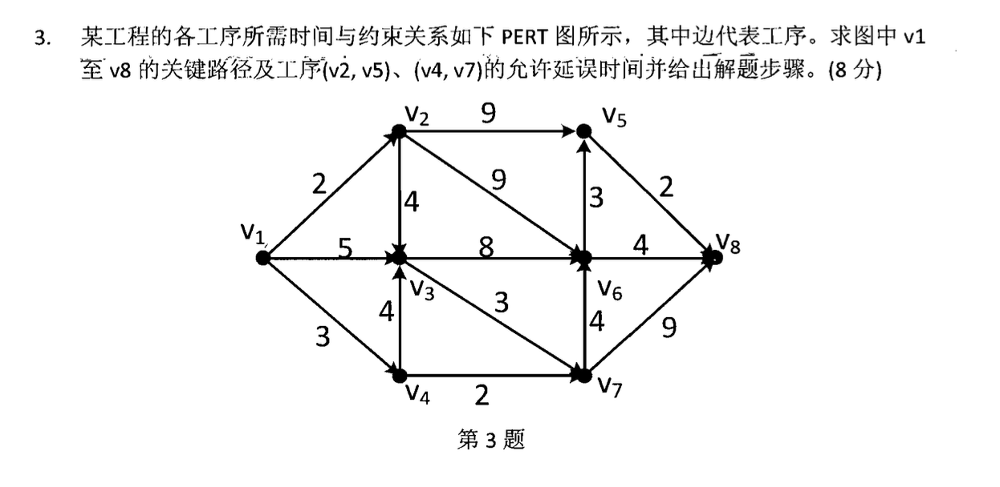

#### 自用图论答案验算库
大部分摘抄自https://www.cnblogs.com/shzr/p/16164277.html
##### cha1
- 邻接矩阵：一个矩阵，a(i,j)=[ij间有边]；**无向图的邻接矩阵是对称的**。
- 权矩阵：w(i,j)=ij间的边权；
- 关联矩阵：**纵列为一行一行点，行为一列一列边，每列一个1一个-1，分别指出的顶点和入的顶点（若有向）**
- 边列表：将每条边的两个端点和权值列出来;
- 正向表：记录每个结点的直接后继。书中的方法类似把若干数组连缀起来，如：1的后继有24,2的后继有13,3的后继有4，4的后继有2.那就先开一个数组记录每个点有几个后继，相当于索引：2,2,1,1；然后用一个大数组记录所有后继：241342.
- 逆向表：和正向表类似，但要改成记录前驱;
- 邻接表：对每个结点，开一个链表存它的后继。
- cha1.cpp 邻接矩阵/权矩阵，关联矩阵，邻接表，正向表，逆向表的表达
##### cha2
###### 1 道路与回路
- 如果一条道路的起点=终点，则称为圈（回路）。
- 没有重复边的道路和回路称为简单道路、回路。没有重复点的称为初级道路、回路。
- 弦：若C是简单图G中**结点大于3**的一个初级回路，x,y在C中不相邻，而(x,y)是G中的一条边，则称(x,y)是C的一条弦。
- 弦的存在性：若G中每个结点的度数均>=3，则G中必含带弦的回路。
- 连通图：任意两点间均存在道路。
- **连通支**：极大连通子图。

###### 2 道路与回路的判定
　　设A是G的邻接矩阵，则
A
k
i
,
j
表示了i能否通过k条边到达j。显然，如果两个结点连通，则它们间必然存在<=n个点的道路。

- **Warshall算法**："三重循环，最外层循环中转点k，之后g[i][j]|=(g[i][k]&g[k][j]);可以求出图中任意两点的连通性。"
  我的理解：

　　也可以使用BFS、DFS来求两点间有无通路，复杂度O(m).

###### 3 欧拉道路与回路
　　经过所有边恰好一次的简单回路（道路）称为G的欧拉回路（道路）。

- 存在欧拉回路⟺图连通，且每个点的度数均为偶数。

- 求欧拉回路的方法：dfs，每找到一个回路后，在G中删去这些边，再找，并把新找到的回路（通过公共结点）连到原回路中去。

　　存在欧拉道路⟺图连通，且至多有两个度数为奇的点

　　有向图：若有向图连通，且每个点入度=出度，则存在有向欧拉回路。

###### 4 哈密顿道路和回路
- 无向图的一条经过所有**点**恰好一次的**初级回路（道路）**称为**哈密顿回路（道路）**，简称H回路（道路）。
- 性质：完全图中存在H回路。
- 定理1：若简单图G的任意两结点间均有**d(x)+d(y)>=n-1**，则存在哈密顿道路。证明：首先G是连通图，取一条极长道路（无法再扩充），若长度<n，则一定存在包含这条道路的回路，换个地方断开就可以再扩充了。
- 定理2：若简单图G的任意两结点间均有d(x)+d(y)>=n，则存在哈密顿回路。
- 闭合图引理：若x,y在G中不相邻，且d(x)+d(y)>=n，设G'=G+(x,y)，则G存在H回路当且仅当G'存在H回路。
- 闭合图：在G中找出不相邻的xy，且d(x)+d(y)>=n，则加入新边(x,y).（此时应更新图的度数）不断增加新边，直到不存在这样的点对。得到的新图称为G的闭合图，记做C(G)。
- 简单图的闭合图是唯一的，不因加边顺序而发生改变。

###### 5 旅行商问题
　　求最优的H回路。

　　分支与界法：其实就是剪枝dfs啦。首先将所有的边权排序，选取前n条边试一试能否构成H回路，然后dfs就可以了。与界是指：看一下当前的dfs序列，如果第x大选取第i大的边，x+1~n顺序选取i+1,i+2……的边，得到的答案已经比之前搜到的答案劣，则直接退出这个分支；如果一条边加入后，使某个点的度数>2，那这次就不应该选这条边。注意：第一次得到的答案不一定是最优的！（其实就是最普通的剪枝，但是做作业的时候迷糊了）如何判断合法：所有点的度数都为2且连通即可构成H回路。

　　便宜算法：就是贪心。逐步加入离“当前结果集合”最近的点即可。如当前的结果序列已经有了1、2两个点，发现5离2的距离是当前所剩边权中最小的，就把5插入结果序列。关于5插到2的左边还是右边？接着贪心即可。这是一个近似算法，不过效果还不错。（如果边权满足三角不等式，那便宜出来的解不会大于正解的两倍！）

　　 

###### 6 最短路径
- **Dijkstra算法**：正权图，s到各点的最短路径 -> zxp ppt讲得很清楚（week4） 有一个小小的坑点：每一次重新找标号目标时候，要看所有点，而不是只看上一次标号过的点的后继
- 边权均为1时，s到各点的最短路径：bfs；
- 边权任意时：Ford算法（也可以SPFA）；区别是：Dijkstra一旦算出某个点的最短路就不会更改，而ford算法可能需要多次更新某个点的最短路。

###### 7 关键路径
- PT图：用结点表示工序，边表示依赖关系，权值写在点上。（DAG）
- 关键路径：在最长路上的工序是不能延误的，而其他工序或许晚一点做也问题不大。
设t(x)表示x这个工序最早可以什么时候开始（即从起点到x的最长路），u(x)表示x这个工序最晚需要什么时候做完（即从x到终点的最长路），那么x可以延误的时间就是u(x)-t(x)-cost(x).即最晚减最早，再减去这个工序本身花费的时间。
- PERT图：抽象！大家都不太完全理解的奇怪东西。用边来表示工序，点来表示依赖关系（如果y工序需要在x工序做完后再做，就让x指向一个点t，y从t指出）这个主要适合于这样多对多的情况“3,5,7工序均依赖于1，2,4”，可以少画几条边。但如果有的工序依赖1，有的工序依赖1、2，这种情况就比较emm。对此，助教的评价是：如果你发现一个图没法画，那他就没法画。
   2013考题：

###### 8 中国邮路
- 中国邮路：有点类似欧拉回路，是指从某结点出发，经过每条边至少一次，最后回到终点的最短回路。

　　以下考虑无向连通图的中国邮路，有两个性质：

　　（1）每条边最多重复一次；（2）对于每个回路，重复边的长度之和不超过整个回路长度的一半；

　　构造方法：首先找出度数为奇数的结点，按照条件（1）随便加点边，得到一个欧拉回路；之后检查每个回路，根据条件（2）调整一下。这是一个很有离散2风格的解法，不怎么追求复杂度，反正考试的时候都是手动跑小数据……还有一个使用最小权匹配的做法，但需要用到一般图匹配，书里也没细讲，主要思路是加边的时候尽量加小的，这样就不太需要调整了。

　　有向图的中国邮路比较复杂，需要考虑入度出度不一致的点，为其增加虚拟节点，还要用费用流。
##### cha3
###### 3.1: 树的有关定义
###### 3.2: 基本关联矩阵及其性质
###### 3.3: 支撑树的计数
https://www.cnblogs.com/shzr/p/10376331.html
看不懂一点
###### 3.4: 回路矩阵和割集矩阵
- ni.ipynb: 矩阵的逆 
###### 3.5: Huffman树
**--19年考了一道手算这个--**
ppt讲得很清楚。
作业题：abbcccdddddeeeee在某进制下最优长度

###### 3.6: 最短树
- kruskal: 
- prim：prim.ipynb
**--2024样卷考题--**

